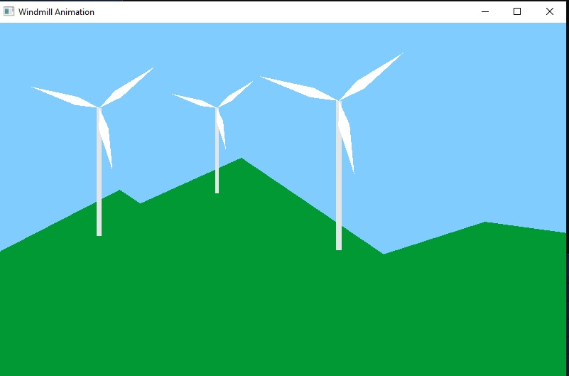

# WINDMILL ANIMATION

This is a simple animation project where a windmill is shown rotating in the background of ridge of hills.

## Table of contents

[Overview](#overview)

- [The challenge](#the-challenge)
- [Screenshot](#screenshot)

- [Links](#links)
- [Built with](#built)

## Overview

### The challange

To draw an animation using glut/opengl library.

### Screenshot

### Links

- [Project demo](https://youtu.be/Vez51t7xgds)

### Built with

- C++
- Glut
